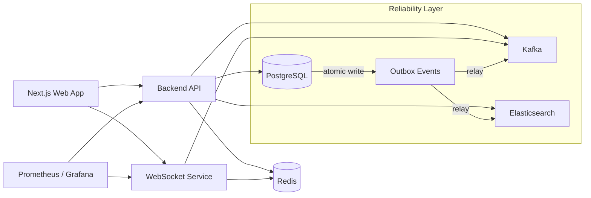

# Modheshwari

Modheshwari is a full-stack community management platform for organizing families, events, resource requests, approvals, communications, and member discovery in a role-based environment. It combines a modern Next.js web app, a Bun-based backend API, and a realtime WebSocket service to support both administrative workflows and everyday community interaction.

## What it does

- Manage family and member records across community hierarchies
- Support role-based access for community heads, subheads, gotra heads, family heads, and members
- Handle event creation, approval, registration, and status workflows
- Process resource requests with multi-step approvals
- Deliver in-app notifications and chat through a dedicated realtime service
- Provide search, discovery, monitoring, and backup tooling for operational use

## Tech stack

- Language: TypeScript
- Runtime: Bun
- Frontend: Next.js 15, React 19, Tailwind CSS, Framer Motion
- Backend: Elysia, Prisma ORM, PostgreSQL
- Realtime: WebSocket service with Redis and Kafka
- Infrastructure: Docker Compose, Nginx, GitHub Actions, Terraform, Prometheus/Grafana
- Search/Observability: Elasticsearch, Prometheus, Alertmanager

## Architecture overview



### Reliability improvements

- **Transactional outbox**: business mutations and outbox events commit atomically in PostgreSQL. A relay worker publishes pending events to Kafka and Elasticsearch with retry and backpressure.
- **Outbox DLQ**: events exceeding max attempts (default 10) are moved to `OutboxEventDeadLetter` for manual inspection and replay.
- **Kafka consumer idempotency**: Redis-backed deduplication prevents duplicate processing across consumer restarts.
- **WebSocket message durability**: chat/notification messages are persisted to PostgreSQL before fan-out. Reconnecting clients recover missed messages via a paginated sync endpoint (`limit` + `cursor`).
- **Elasticsearch derived index**: ES indexing is routed through the outbox relay. A periodic reconciliation worker re-indexes recently updated documents to repair drift.
- **Role-change audit**: every role change is recorded in an immutable audit log with anomaly counters for rate-limited and mass-demotion patterns.

## API docs

The current API contract is documented in [openapi.yaml](openapi.yaml). Regenerate it with `bun run openapi:gen` when backend routes change.

## Repository structure

- apps/be — Bun-based backend API and business workflows
- apps/web — Next.js frontend
- apps/ws — realtime WebSocket service
- packages/db — Prisma schema, migrations, and seed data
- packages/utils — shared auth, response, rate-limit, and pagination helpers
- monitoring — Prometheus, Alertmanager, Grafana, and alert rules
- infra/terraform — AWS infrastructure definitions

## Prerequisites

- Bun 1.2+
- Docker Desktop or Docker Engine
- PostgreSQL and Redis are provided by Docker Compose

## Getting started

1. Copy the environment template:

   ```bash
   cp .env.example .env
   ```

2. Install dependencies:

   ```bash
   bun install
   ```

3. Start the supporting services:

   ```bash
   docker compose up -d db redis zookeeper kafka
   ```

4. Apply database migrations:

   ```bash
   bunx prisma migrate dev --schema packages/db/schema.prisma
   ```

5. Start the full development stack:

   ```bash
   bun run dev
   ```

The web app will typically be available at http://localhost:3000, the backend at http://localhost:3001/api/health, and the websocket service at http://localhost:3002/health.

## Demo credentials

If you seed the database with `bun run db:seed`, you can sign in with any of these demo accounts using the password `demo123`:

- `vikram@demo.com` - community head
- `sunita@demo.com` - community subhead
- `ramesh@demo.com` - gotra head
- `rajesh@demo.com` - family head
- `neha@demo.com` - member

## Useful commands

- Run linting: `bun run lint`
- Run type checks: `bun run check-types`
- Generate docs: `bun run docs:gen`
- Generate OpenAPI: `bun run openapi:gen`
- Seed the database: `bun run db:seed`

## Environment and secrets

This repository intentionally ignores local environment files. Only [.env.example](.env.example) is tracked as a template. Do not commit real `.env` files, private keys, or credentials.

## Deployment and operations

- Containerized deployment is defined in [docker-compose.yml](docker-compose.yml)
- CI/CD automation is defined in [.github/workflows/deploy.yml](.github/workflows/deploy.yml)
- Backup automation is defined in [.github/workflows/postgres-backup.yml](.github/workflows/postgres-backup.yml)
- Infrastructure definitions are in [infra/terraform/main.tf](infra/terraform/main.tf)
- Additional architecture context is available in [design.md](design.md) and [ARCHITECTURE_MINIMAP.md](ARCHITECTURE_MINIMAP.md)

## Release

Current release: v0.1.0

## License

This project is licensed under the [MIT License](LICENSE).